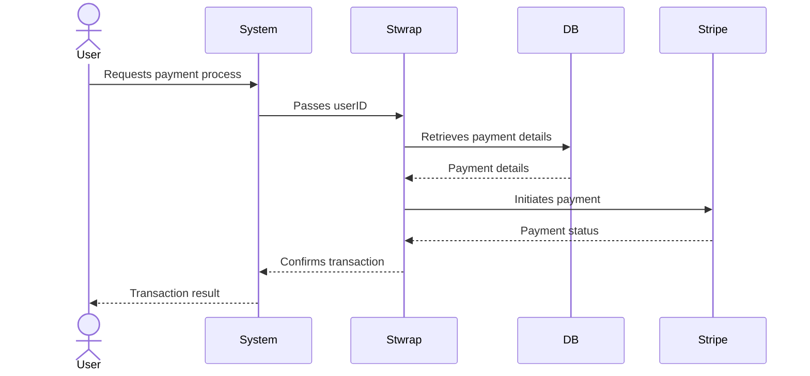

# Stwrap Java

This library is designed to link your service's user ID with the Stripe customer ID for easy payment processing. Below
is a sample table definition which you can customize according to your user ID format.

## 機能

- Stripe 顧客と既存システムの利用者の紐づけ

## 前提条件

- Java 11 またはそれ以上
- Maven

## インストール

Mavenを使用してstwrapをプロジェクトに追加します

```xml

<dependency>
    <groupId>digiot</groupId>
    <artifactId>stwrap</artifactId>
    <version>0.9.0</version>
</dependency>
```

## 使い方

### テーブル構築

初めに、以下を参考に `user_stripe_link` テーブルを構築します。user_id カラムは、ご自身のシステムで管理している利用者IDに使用している型にあわせてください。

```sql
CREATE TABLE user_stripe_link
(
    id                 VARCHAR(32) PRIMARY KEY,
    user_id            VARCHAR(255) NOT NULL,
    stripe_customer_id VARCHAR(255) NOT NULL,
    primary BOOLEAN DEFAULT FALSE,
    deleted         BOOLEAN   DEFAULT FALSE,
    created_at         TIMESTAMP DEFAULT CURRENT_TIMESTAMP,
    updated_at         TIMESTAMP DEFAULT CURRENT_TIMESTAMP ON UPDATE CURRENT_TIMESTAMP
);
```

We recommend putting indexes on `user_id` and `stripe_customer_id`.

```sql
CREATE INDEX idx_user_stripe_link_user_id ON user_stripe_link (user_id);
CREATE INDEX idx_user_stripe_link_stripe_customer_id ON user_stripe_link (stripe_customer_id);
```

### 実装

**既存システムの利用者にサブスクリプションを適用する場合：**

```java
import com.stripe.Stripe;
import digiot.stwrap.application.CustomerService;
import digiot.stwrap.domain.model.UserId;
import digiot.stwrap.domain.repository.StripeLinkedUserRepository;

public class SubscriptionExample {

    static {
        // It is also possible to set the environment variable STRIPE_API_KEY.
        Stripe.apiKey = "your_api_key_here";
    }

    StripeLinkedUserRepository repository = new ImplementedStripeLinkedUserRepository();
    CustomerService customerService = new CustomerService(repository);
    SubscriptionService subscriptionService = new SubscriptionService(customerService);

    public void subscription(String planId, String token, int quantity) {
        UserId userId = UserId.valueOf(/*  Your system's user_id. */);
        Subscription subscription = subscriptionService.createSubscriptionWithToken(userId, planId, token, quantity);
        // any code...
    }
}
```

Spring Data JPA をサポートしています。上記の場合、Spring をご使用の場合は `@Autowired`
アノテーションを付与した `SubscriptionService` を定義するだけで使用することができます。。

**既存システムの利用者に紐づく、 Stripe が保持している Customer オブジェクトを取得したい場合：**

```java
import com.stripe.model.Customer;
import digiot.stwrap.application.CustomerService;
import digiot.stwrap.domain.model.StripeLinkedUser;
import digiot.stwrap.domain.repository.StripeLinkedUserRepository;

public class CustomerExample {

    static {
        // It is also possible to set the environment variable STRIPE_API_KEY.
        Stripe.apiKey = "your_api_key_here";
    }

    StripeLinkedUserRepository repository = new ImplementedStripeLinkedUserRepository();
    CustomerService customerService = new CustomerService(repository);

    public Customer getStripeCustomer() {
        UserId userId = UserId.valueOf(/*  Your system's user_id. */);
        StripeLinkedUser linkedUser = customerService.getOrCreateStripeLinkedUser(userId);
        return Customer.retrieve(linkedUser.getStripeCustomerId());
    }
}
```

==== TODO ====

## Tips

### UserStripeLinkEntity

以下は、サービスのユーザーIDとStripe顧客IDの関係をモデル化する`UserStripeLinkEntity`クラスです。`userId`
フィールドは連携システムで扱うユーザーIDの型をラップする役割があります。

```java
import java.time.LocalDateTime;

public class UserStripeLinkEntity {

    private String id;
    private UserId userId;
    private String stripeCustomerId;
    private boolean isDeleted;
    private LocalDateTime createdAt;
    private LocalDateTime updatedAt;

}
```

## UserStripeLinkRepository

基本的には、Spring での使用を想定しています。Spring Data JPA をサポートしています。

## 想定される決済手段
| ケース番号 | 登録状況 | 決済手段の登録 | 決済時の行動                             | 必要なパラメータ (Stripe)   | 必要なパラメータ (本ライブラリ)         | 備考                              |
|------------|----------|----------------|--------------------------------------|----------------------|-------------------------------|-----------------------------------|
| 1          | 未登録   | あり           | 決済時に決済手段を登録する                 | `token_id`, `plan_id` | `user_id`, `register`                |                                   |
| 2          | 未登録   | なし           | 決済手段のみ登録する                      | `token_id`           | `user_id`                          |                                   |
| 3          | 未登録   | あり           | 決済時に既存の決済手段を指定する             | `payment_method_id`  | `user_id`, `register`                |                                   |
| 4          | 登録済み | なし           | 決済手段のみ登録する（単一のlink_id）      | `token_id`           | `link_id`                          |                                   |
| 5          | 登録済み | なし           | 決済手段のみ登録する（複数のlink_id）      | `token_id`           | `user_id`                          | Primary設定されたlink_idが使用される |
| 6          | 登録済み | あり           | 決済時に新しい決済手段を登録する（単一のlink_id） | `token_id`, `plan_id` | `link_id`, `register`               |                                   |
| 7          | 登録済み | あり           | 決済時に新しい決済手段を登録する（複数のlink_id） | `token_id`, `plan_id` | `user_id`, `register`               | Primary設定されたlink_idが使用される |
| 8          | 登録済み | なし           | 既存の決済手段を使用して決済する（単一のlink_id） | `payment_method_id`, `plan_id` | `link_id`                    |                                   |
| 9          | 登録済み | なし           | 既存の決済手段を使用して決済する（複数のlink_id） | `payment_method_id`, `plan_id` | `user_id`                    | Primary設定されたlink_idが使用される |


