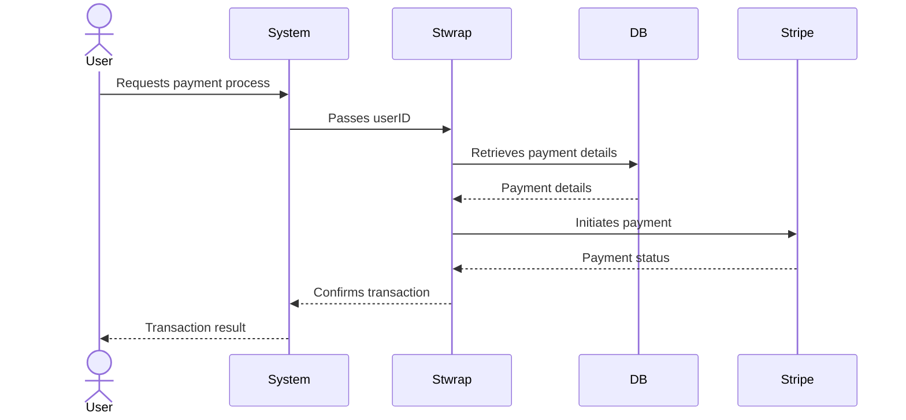

# Stwrap

This library is designed to link your service's user ID with the Stripe customer ID for easy payment processing. Below
is a sample table definition which you can customize according to your user ID format.

## Sample Table Definition

Here's a sample SQL script to create the `user_stripe_link` table:

```sql
CREATE TABLE user_stripe_link
(
    id                 VARCHAR(32) PRIMARY KEY,
    user_id            VARCHAR(255) NOT NULL,
    stripe_customer_id VARCHAR(255) NOT NULL,
    deleted         BOOLEAN   DEFAULT FALSE,
    created_at         TIMESTAMP DEFAULT CURRENT_TIMESTAMP,
    updated_at         TIMESTAMP DEFAULT CURRENT_TIMESTAMP ON UPDATE CURRENT_TIMESTAMP
);
```

Please ensure that the user_id field type matches the type of the user ID used in your service. Adjust the VARCHAR
length accordingly.

We recommend putting indexes on user_id and stripe_customer_id.

```sql
CREATE INDEX idx_user_stripe_link_user_id ON user_stripe_link (user_id);
CREATE INDEX idx_user_stripe_link_stripe_customer_id ON user_stripe_link (stripe_customer_id);
```

## UserStripeLinkEntity

以下は、サービスのユーザーIDとStripe顧客IDの関係をモデル化する`UserStripeLinkEntity`クラスです。`userId`
フィールドはジェネリックで、ユーザーIDフィールドに合わせて任意の型を使用できます。

```java
import java.time.LocalDateTime;

public class UserStripeLinkEntity<T> {

    private String id;
    private T userId;
    private String stripeCustomerId;
    private boolean isDeleted;
    private LocalDateTime createdAt;
    private LocalDateTime updatedAt;

    // ゲッターとセッター
}
```

## UserStripeLinkRepository

ユーザーとStripe顧客IDのリンクを管理するUserStripeLinkRepositoryインターフェイスも実装する必要があります。その一例を以下に示します。

```java
import digiot.stwrap.domain.model.StripeLinkedUser;
import digiot.stwrap.domain.model.UserStripeLink;
import digiot.stwrap.domain.model.UserStripeLinkEntity;

import java.util.List;

public interface UserStripeLinkRepository<T> {

    List<StripeLinkedUser<T>> findAllLinksByUserId(T userId);

    StripeLinkedUser<T> findLatestLinkByUserId(T userId);

    StripeLinkedUser<T> create(StripeLinkedUser<T> StripeLinkedUser);

    void update(StripeLinkedUser<T> link);

    void delete(StripeLinkedUser<T> link);
}
```

このインターフェイスは、ユーザーとStripeのリンクを管理するために必要な基本的なCRUD操作を定義しています。

## 想定される決済手段
| ケース番号 | 登録状況 | 決済手段の登録 | 決済時の行動                             | 必要なパラメータ (Stripe)   | 必要なパラメータ (本ライブラリ)         | 備考                              |
|------------|----------|----------------|--------------------------------------|----------------------|-------------------------------|-----------------------------------|
| 1          | 未登録   | あり           | 決済時に決済手段を登録する                 | `token_id`, `plan_id` | `user_id`, `register`                |                                   |
| 2          | 未登録   | なし           | 決済手段のみ登録する                      | `token_id`           | `user_id`                          |                                   |
| 3          | 未登録   | あり           | 決済時に既存の決済手段を指定する             | `payment_method_id`  | `user_id`, `register`                |                                   |
| 4          | 登録済み | なし           | 決済手段のみ登録する（単一のlink_id）      | `token_id`           | `link_id`                          |                                   |
| 5          | 登録済み | なし           | 決済手段のみ登録する（複数のlink_id）      | `token_id`           | `user_id`                          | Primary設定されたlink_idが使用される |
| 6          | 登録済み | あり           | 決済時に新しい決済手段を登録する（単一のlink_id） | `token_id`, `plan_id` | `link_id`, `register`               |                                   |
| 7          | 登録済み | あり           | 決済時に新しい決済手段を登録する（複数のlink_id） | `token_id`, `plan_id` | `user_id`, `register`               | Primary設定されたlink_idが使用される |
| 8          | 登録済み | なし           | 既存の決済手段を使用して決済する（単一のlink_id） | `payment_method_id`, `plan_id` | `link_id`                    |                                   |
| 9          | 登録済み | なし           | 既存の決済手段を使用して決済する（複数のlink_id） | `payment_method_id`, `plan_id` | `user_id`                    | Primary設定されたlink_idが使用される |


