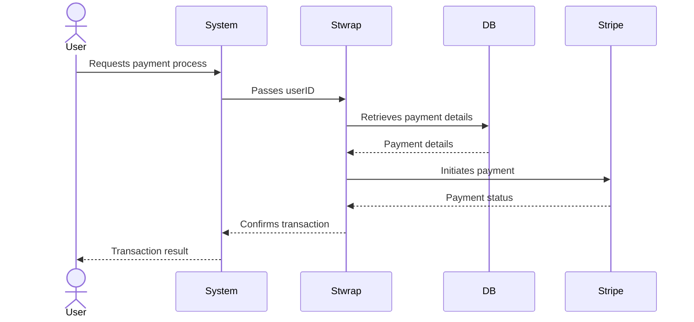

# Stwrap Java

This library is designed to link your service's user ID with the Stripe customer ID for easy payment processing. Below
is a sample table definition which you can customize according to your user ID format.

## Features

- Linking Stripe customers with existing system users.

## Prerequisites

- Java 11 or higher.
- Maven.

## Installation

Add stwrap to your project using Maven.

```xml
<dependency>
    <groupId>digiot.stwrap</groupId>
    <artifactId>stwrap-java</artifactId>
    <version>0.9.0</version>
</dependency>
```

## Usage

### Table Setup

First, create the `user_stripe_link` table based on the following. Adjust the `user_id` column to match the data type used for user IDs in your own system.

```sql
-- stripe_linked_user
CREATE TABLE IF NOT EXISTS stripe_linked_user
(
    id                 VARCHAR(32) PRIMARY KEY,
    user_id            VARCHAR(255) NOT NULL,
    stripe_customer_id VARCHAR(255) NOT NULL,
    deleted         BOOLEAN   DEFAULT FALSE,
    created_at         TIMESTAMP DEFAULT CURRENT_TIMESTAMP,
    updated_at         TIMESTAMP DEFAULT CURRENT_TIMESTAMP ON UPDATE CURRENT_TIMESTAMP
);

CREATE INDEX IF NOT EXISTS idx_stripe_linked_user_user_id ON stripe_linked_user (user_id);
CREATE INDEX IF NOT EXISTS idx_stripe_linked_user_stripe_customer_id ON stripe_linked_user (stripe_customer_id);

-- stripe_payment_intents
CREATE TABLE IF NOT EXISTS stripe_payment_intents
(
    id                 VARCHAR(32) PRIMARY KEY,
    stripe_linked_user_id VARCHAR(32),
    status VARCHAR(50),
    amount INT,
    currency VARCHAR(10),
    deleted BOOLEAN DEFAULT FALSE,
    created_at TIMESTAMP DEFAULT CURRENT_TIMESTAMP,
    updated_at TIMESTAMP DEFAULT CURRENT_TIMESTAMP ON UPDATE CURRENT_TIMESTAMP,
    FOREIGN KEY (stripe_linked_user_id) REFERENCES stripe_linked_user(id) ON DELETE SET NULL
    );

CREATE INDEX IF NOT EXISTS idx_payment_intents_stripe_linked_user_id ON stripe_payment_intents (stripe_linked_user_id);

-- stripe_setup_intents
CREATE TABLE IF NOT EXISTS stripe_setup_intents
(
    id                 VARCHAR(32) PRIMARY KEY,
    stripe_linked_user_id VARCHAR(32),
    status VARCHAR(50),
    deleted BOOLEAN DEFAULT FALSE,
    created_at TIMESTAMP DEFAULT CURRENT_TIMESTAMP,
    updated_at TIMESTAMP DEFAULT CURRENT_TIMESTAMP ON UPDATE CURRENT_TIMESTAMP,
    FOREIGN KEY (stripe_linked_user_id) REFERENCES stripe_linked_user(id) ON DELETE SET NULL
    );

CREATE INDEX IF NOT EXISTS idx_setup_intents_stripe_linked_user_id ON stripe_setup_intents (stripe_linked_user_id);
```

### Implementation

**If applying a subscription to an existing system user:**

```java
import com.stripe.Stripe;
import digiot.stwrap.application.CustomerService;
import digiot.stwrap.domain.model.UserId;
import digiot.stwrap.domain.repository.StripeLinkedUserRepository;

public class SubscriptionExample {

    static {
        // It is also possible to set the environment variable STRIPE_API_KEY.
        Stripe.apiKey = "your_api_key_here";
    }

    StripeLinkedUserRepository repository = new ImplementedStripeLinkedUserRepository();
    CustomerService customerService = new CustomerService(repository);
    SubscriptionService subscriptionService = new SubscriptionService(customerService);

    public void subscription(String planId, String token, int quantity) {
        UserId userId = UserId.valueOf(/*  Your system's user_id. */);
        Subscription subscription = subscriptionService.createSubscriptionWithToken(userId, planId, token, quantity);
        // any code...
    }
}
```

It supports Spring Data JPA. In the above case, if you are using Spring, you can use `@Autowired` annotation to define the `SubscriptionService` and use it.

**If you want to retrieve the Customer object maintained by Stripe for an existing system user:**

```java
import com.stripe.model.Customer;
import digiot.stwrap.application.CustomerService;
import digiot.stwrap.domain.model.StripeLinkedUser;
import digiot.stwrap.domain.repository.StripeLinkedUserRepository;

public class CustomerExample {

    static {
        // It is also possible to set the environment variable STRIPE_API_KEY.
        Stripe.apiKey = "your_api_key_here";
    }

    StripeLinkedUserRepository repository = new ImplementedStripeLinkedUserRepository();
    CustomerService customerService = new CustomerService(repository);

    public Customer getStripeCustomer() {
        UserId userId = UserId.valueOf(/*  Your system's user_id. */);
        StripeLinkedUser linkedUser = customerService.getOrCreateStripeLinkedUser(userId);
        return Customer.retrieve(linkedUser.getStripeCustomerId());
    }
}
```

### Processing Flow

